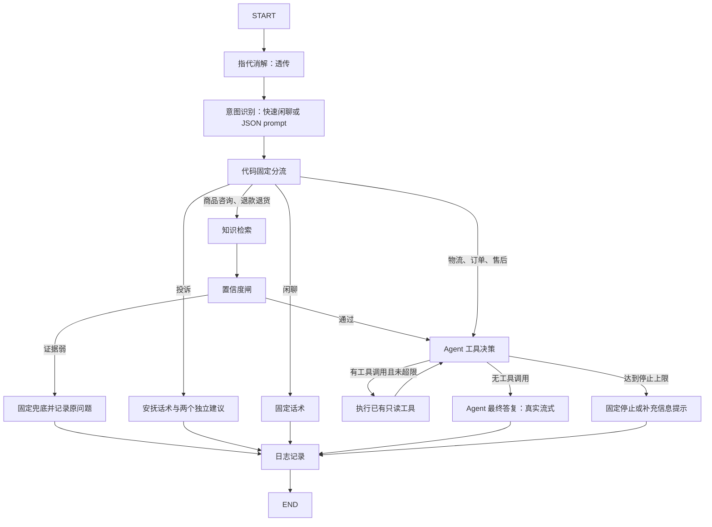

# ch05：确定性 Workflow 与核心 ReAct Agent 设计

日期：2026-10-03。状态：已完成自检及独立设计复审修订，等待用户审阅；未进入实施计划或实现。

## 目的与已确认口径

将现有单次 Function Calling 客服升级为确定性 Workflow 骨架，并将可迭代调用工具的 Agent 放在受控节点中。验收关注显式执行路径、证据先行、用户选择与持久会话，不把本章称为已经完成多实例部署或真实人工客服接入。

用户明确指定 LangGraph 图编排、State 和自带 checkpointer；前端为原生 HTML/CSS/JavaScript。订单、物流等工具复用第 2 章，知识检索复用第 3/4 章。指代消解原样透传；七类意图用简单 prompt 输出 JSON；正式意图/指代、上下文管理升级、MCP 业务接入和飞轮入库留到后续。

用户对闲聊歧义回复“行”，确认：常见问候、感谢、道别等用代码快速路径，整个请求零模型调用；其他消息调用一次意图 prompt，若判为闲聊，则固定回复且不进入 Agent。不能将“分类一次后返回固定回复”声称为整个请求零模型调用。

## 仓库现状与复用边界

- `app/services/chat.py` 当前最多一次工具调用，随后无工具生成；持久记录 Conversation/Message，已校验会话归属。
- `app/tools/business.py` 提供 `query_order`、`query_product`、`query_logistics`、`query_faq`、`create_ticket`；订单、商品、物流仍为模拟数据，本章不会将这些工具重写为真实业务接口。
- `QualityRetriever.retrieve_with_trace` 返回权威 Evidence、分数和检索阶段 trace；`KnowledgeRetriever.search` 支持第 3 章 dense 检索。优先复用 ch04 hybrid_rerank；`QUALITY_ENABLED=false` 仍复用 ch03 dense 路径。
- `QualityLedger.add_low_confidence` 保存原问题、会话外键、来源和原因，可直接用于本章证据弱记录。
- `/` 目前优先服务 React dist；`app/static/index.html` 是完整原生聊天页。ch05 将明确让默认首页加载该原生页，原 React 源码和构建产物保留，不再作为本章默认入口。
- ch04 的检索/生成评估与旧生成服务继续保留；ch05 在线路径改为检索前置闸门后流式 Agent，不调用旧 `KnowledgeAnswerService.answer()` 做第二次检索或整答缓冲校验。

## 方案比较与推荐

推荐将 Workflow 与 Agent 的决策/工具/答复阶段显式放在同一张 StateGraph 中。State 不跨子系统复制，工具步骤可独立 checkpoint，日志能看清每次循环与固定路由。

另一方案是外层图的单个 Agent 节点内部手写循环。结构更短，但工具步骤之间的 State 不进入图 checkpoint，较难观察与检查恢复行为，因此不作为最终架构。裸循环仍单独保留为热身演示，最终用前一方案重构。

## 裸 Agent 循环：先写再重构

先实现一个不依赖 LangGraph 或 LangChain Agent 编排器的普通 Python 循环：调用 LLM → 有 tool calls 就调用已有工具执行器 → 将带 call_id 的结果加入消息 → 再调用 LLM → 无工具调用时收敛成答案或澄清问题。调用与工具执行通过窄接口注入，业务工具不重写。

演示命令支持离线脚本化模型，展示查订单后查物流的两个观察步骤；另支持配置好的真实模型。记录实际 LLM 调用、工具步数与停止原因。先用测试证明循环行为，再将相同的消息协议、停止策略和工具适配拆入 LangGraph 节点。教学循环与生产图各自有验收，不能只在文档里描述“写过裸循环”。

## 图与七类意图四个出口

七类意图只接受 `物流`、`订单`、`商品咨询`、`退款退货`、`售后`、`投诉`、`闲聊`。分类 JSON 解析失败或类别不合法时固定提示用户重新描述，不自行猜类别、不进入 Agent，并记为分类失败。

四个出口固定命名为 `knowledge`（商品咨询、退款退货）、`business`（物流、订单、售后）、`complaint`（投诉）、`chitchat`（闲聊）。分类失败属于错误路径，不是第五类意图出口；置信度闸的通过/拒答属于 knowledge 内部子路径。

路由映射写成可审计的代码常量，不让模型输出路由名或执行图跳转。退款退货必须先检索政策，再过闸门；通过后 Agent 仍可查询订单/物流。订单或物流类不预检索、完全绕开置信度闸。投诉仅固定安抚与操作建议；闲聊仅固定话术。这两类可以经过意图 prompt，但从不进入 Agent。

## State 与持久化

定义 TypedDict State，保存会话与用户标识、原问题、透传问题、累计消息、分类及错误状态、固定 route、当轮证据快照/分数/trace、闸门结果、Agent 循环计数、token 用量与预算、停止原因、建议操作、答复和 message_id。已有 Message 表保留用于聊天记录与后续会话知识抽取；LangGraph checkpointer 是图状态的权威持久化，不能用 Message 表冒充 checkpointer。

`thread_id` 由服务端根据校验后的会话标识构造；校验会话归属必须在读取 checkpoint 之前。`messages` 使用消息 reducer，其他当轮字段每次请求显式重置，防止上轮证据、建议按钮、预算计数串到下一轮。旧会话首次进入图时导入已有消息；有 checkpoint 时以 State 消息为主，避免重复追加历史。

本章使用 LangGraph 官方 `SqliteSaver`，独立文件路径默认 `.runtime/ch05/checkpoints.sqlite`，生命周期由应用管理，关闭时释放连接。按会话串行处理本进程中的请求，防止相同 thread 的 State 相互覆盖；不同会话可独立处理。部署演示明确为单进程，SQLite 仅用于本章可复现持久化。多副本分布式并发、真实身份认证与生产外部 checkpoint 后端不在本章验收范围；若要求上线多副本，暂停确认部署边界，不自行更换技术。

验收必须重建服务实例后仍能从同一 checkpoint 文件读回会话 State，并证明不同用户不能读取别人的 checkpoint。完成回复保存 checkpoint 后再发 done；异常或客户端中断不能发成功 done。checkpointer 并不自动保证 HTTP SSE 恰好一次，也不保证跨业务数据库的事务，本章不做此类承诺。

## 最简置信度闸

知识检索结果先保存为当轮 State 证据，再做闸门判断。ch04 使用 `hybrid_rerank` 分数，门槛复用 `RERANK_MIN_SCORE`（当前基线 0.05）；ch03 使用自身 COSINE 阈值与已过滤命中。两者分数不可混用。无证据、有效正文为空或有效最高分低于阈值则拒答；只将有合法正文和有限分数的证据喂给 Agent。

拒答使用固定兜底，不调用 Agent；通过 `QualityLedger` 保存原问题，`source=retrieval_low_conf`，reason 包含采用的策略、得分与阈值。写账本失败则返回服务错误，不能报告完整处理成功。检索服务故障记为服务错误，与“检索成功但证据弱”区分。

该门槛只是简单检索侧保护，不等于正式证据覆盖度模型，也不能保证所有多条件问题都答对。通过后将完整当轮证据与原问题交给 Agent；证据作为不可信数据，不能覆盖系统指令。知识答案要求保留条件、否定与合法 [n] 引用，不承诺退款到账、到货时间、退款成功或赔付金额。最终答案真实流式输出，不在答完后补做隐藏的置信度闸；正式检查留给后续可观测章节。

## ReAct 循环、最终流式回复与预算

核心 Agent 拆成工具决策、工具执行和最终答复三个图阶段。工具决策使用 LLM Function Calling；有工具就执行并回填观察，再决策下一步；无工具时返回受约束的 JSON 完成信号与可选操作，不在决策阶段生成用户正文。最终答复阶段不再绑定工具，调用模型的 stream，经 `get_stream_writer`/custom stream 逐块转发给 SSE。这样不将工具参数或中间推理混入用户回复，亦不把整段预生成答案切块伪装成实时流式。

最终答复会额外使用一次模型调用，明确计入用量。简单订单/物流问题执行一次业务工具后收敛；复杂请求可以先查订单再按结果查物流；缺少订单号等信息时询问用户，不能填造 ID。每次完整调用都记录 usage 和阶段，不显示模型内部推理。

只读工具来自原 `build_tools`，支持多个合法 tool calls，保持每个 call_id 与 ToolMessage 配对。`create_ticket` 不注册到自主 Agent 执行器；即便模型提出这个名称，也只转换为建议或安全工具错误，不能执行。自主 Agent 仅绑定原 `query_order`、`query_product`、`query_logistics`；`query_faq` 不绑定，知识由固定检索节点提供，确保业务分支不发生预检索或自主知识检索，也不通过工具绕过闸门。已有 FAQ 工具本身保留。

停止控制：单轮最多 4 次工具决策、6 次实际只读工具执行、单次生成最多 512 output tokens；单轮累计模型预算默认 12000 tokens（覆盖意图识别与 Agent，检索器内部既有归一化调用另列）。预算与输出上限可配置并校验为正整数。调用前计算输入预算并限制可用输出；超过预算、重复相同工具调用、模型超时或非法完成信号时停止，返回确定性提示或服务错误。工具执行不自动创建写操作，也不无限重试。

优先使用真实 usage_metadata；供应商缺 usage 时采用保守估算并标注 estimated。日志分开列出实际计费可见值与估算值，不把估算声称为精准 token 账单。历史过长则提示本轮无法继续并建议新会话，不在本章引入自动摘要或截断策略。

## 用户操作建议与两个独立按钮

后端输出结构化建议事件 `actions`，items 仅允许 `handoff` 和 `create_ticket`。投诉固定给两个；Agent 判断缺信息无法处理、工具失败或诉求需进一步人工跟进时，可建议一个或两个；正常完成时可不建议。只有本条回复明确建议的操作才显示按钮，不给每轮强制增加两个按钮，符合用户“可只给一个也可两个都给”的要求。建议绑定具体 assistant message 与会话，不根据自然语言猜按钮，不调用工单工具，不设置挂起 interrupt 阻塞后续聊天。

前端每个建议渲染独立按钮，并提供独立确认交互。用户取消确认或不点击时无副作用；输入新消息继续正常 Workflow。

- 点“转人工”并确认：仅前端追加“已转接人工客服”，随后追加“您好，我是客服小猫，请问有什么可以帮您的”；不发工单请求、不写 tickets、不禁止继续发送消息。本章明确模拟，不接真人系统。
- 点“建工单”并确认：前端只调用独立的 `POST /api/v1/tickets`。请求携带会话/用户、建议所属 message_id；服务端验证会话归属与该消息确实有建工单建议，从服务器保存的问题取得 description/ticket_type，再调用第 2 章原 `create_ticket`。禁止借按钮接口让 Agent 自动建单。

服务端以同一建议消息作为提交幂等单位，已成功的重复请求返回同一 ticket_no，处理中或结果未知的重复请求不再次调用写工具；前端提交时只禁用本建工单按钮，转人工按钮保持独立。复用原 Ticket 表；新增可空 `Message.actions` JSON 字段保存建议类型、关联原问题、工单提交状态和 ticket_no，提供兼容 SQLite/MySQL 的显式迁移。既有工具接口与业务字段不改变。

调用工单工具前，接口必须先原子地把建议从 offered 标记为 submitting 并提交该状态；只有获得本次提交资格的请求可以调用写工具。成功后保存 created 与 ticket_no。重复请求读到 created 返回原单号，读到 submitting/unknown 则提示处理中或需核查，不再次调用工具。并发重复请求通过本进程会话锁及持久状态检查约束。

工单工具原本有超时结果未知的保护；按钮接口继承这一语义，未知结果不提示“已创建”也不允许自动重试写操作。工单工具调用与建议状态是不同事务，不能声称通过普通 JSON 标记实现崩溃后的恰好一次；进程若在提交标记后、写工具前或写工具后崩溃，可能留下 submitting，重启后保持禁止重试并提示人工核查，不能据此声称 ticket 已创建。异常/中断留下可核查状态。本章不新增工单查询业务工具或后台自动补偿。

## HTTP、前端与日志

保留 `POST /api/v1/chat/stream` 与 `token`、`tool_status`、`citations`、`done`、`error` 事件。新增 `workflow_status` 仅展示节点进度与工具步数，新增 `actions` 给独立按钮；不通过事件暴露完整 State、prompt 或内部推理。done 包含已保存的 message_id、route 与停止原因，便于验收。

默认 `/` 服务原生页；保留现有来源文档受限路由。作为入口切换的兼容保留项，原生页补上当轮 citations 展示和原文链接，避免丢失 ch04 知识引用能力；已有本地满意度反馈机制迁移到原生页，仍仅写浏览器。仅迁移已存在的行为，不重新设计工作台、不扩展反馈采集或后端接口。售后抽取 API 保留，React 文件无需删除。

日志节点持久记录 JSONL：run_id、conversation_id、节点路径、意图、四出口之一、闸门结果与分数、证据 ID、工具名/步数/耗时/成功状态、token 用量/估算标记、停止原因和失败阶段。默认 `.runtime/ch05/workflow.jsonl`。不记录密钥、完整 prompt 或内部推理；证据弱的原问题通过既有受控账本保存。异常亦记录失败路径，不伪造节点已经走过。

## 验证与交付

代码按 TDD 实施。纯意图/Agent prompt 建立标注样例集，覆盖七类、常见闲聊快速路径、退款政策与售后处理差异、缺信息、复杂两步请求和投诉；用真实配置模型跑评估，记录 JSON/类别正确率与逐题输出，分类失败单列，不能把 FakeModel 单测当作真实 prompt 效果。

核心自动化验收：

1. 政策/商品必走 retrieve → gate → agent；证据弱零 Agent 调用且记原问题，检索故障不假称无证据。
2. “订单 1001 的物流到哪了”通过 Agent 自选 query_logistics，不走检索/闸门。
3. 复杂订单后物流请求至少两次工具执行，ToolMessage 正确回填，预算/循环/重复调用均有停止验证。
4. 投诉无 Agent 工具调用；两个建议独立；不点击、取消、仅转人工均零 tickets；点击建工单才落表；同一建议重复提交不重复落表；继续发消息不中断。
5. 闲聊快捷规则零模型；prompt 分类成闲聊仅分类一次，无 Agent。
6. checkpoint 跨实例恢复，逐轮字段重置，会话隔离和归属检查；SSE 最终答复在模型下一块产出前已经传出当前块。
7. 原生首页真实生效、引用与本地反馈可用；前端浏览器交互验证两按钮、取消确认、重复点击和继续对话。

最终运行新增专项、现有 Python 回归、对应静态页检查、迁移及实际模型/服务烟测；报告离线与 live 的区别、未通过项和环境限制。交付裸循环演示命令、图/页面演示命令、测试及评估结果、`dev-notes/ch05.md` 路径。

每个阶段完成即时追加 dev-notes：用户关键原话、spec/plan 或评审路径与结论、用户拒绝/纠偏、失败返工。现有未提交的 ch04 文档和实验不纳入本章提交。下一步为用户审阅本 spec，再按 writing-plans 产出计划，评审后选择执行方式。

## 文档与环境核查

Context7 已查 LangGraph 官方 StateGraph、conditional edges、custom stream、SqliteSaver/thread_id；LangChain 工具绑定与 chunk 聚合；FastAPI StreamingResponse/lifespan；SQLAlchemy sessionmaker.begin。具体实施任务前继续查对应库的准确 API 与已安装版本，涉及新迁移或适配器的接口不能直接沿用记忆。

2026-10-03 使用 `/usr/bin/python3` 探测：langgraph 1.2.12、langchain 1.4.2、langchain-core 1.6.4、langchain-openai 1.6.3、fastapi 0.141.1、SQLAlchemy 2.0.54。仓库无 `.venv`，也无 `python` 命令；演示命令统一使用 python3。已核实 `langgraph-checkpoint-sqlite` 未安装，实施时补充该官方依赖，依赖版本按实际官方 API 验证后固定兼容范围。

## 设计自检与独立审阅

自检已清除工具开放范围及 action 存储的模糊条款；七类意图、四出口、错误路径、最简闸门与真实流式阶段各有明确定义。Luna 首轮指出工单两事务幂等风险，已补充先持久化提交资格、未知禁止重试与崩溃遗留状态的限制。其按钮每轮都显示的疑问与用户“Agent 判断合适时……可只给一个也可两个都给”不符，因此保留条件展示，并明确展示条件。工具隔离在修订版已明确为仅绑定三个原只读业务工具。兼容迁移与真实 prompt 评估分别来自已有页面行为及用户明确工作要求，保留但限制范围，不用合成测试替代真实评估。
