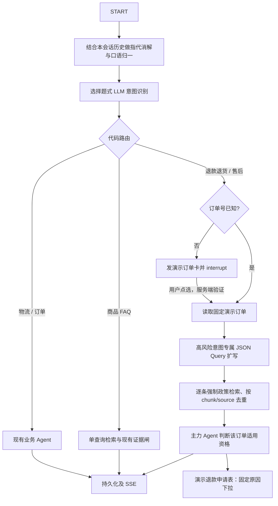

# 第六章：正式工作流分流器设计

## 目标

把当前占位分流器升级为可评估、可恢复、确定性执行退款/退货与售后子流程的 Workflow 核心节点，并在实际服务的聊天页提供订单点选和退款申请表单。

## 用户需求与约束

- 对话历史只用于解决本轮指代和口语归一；问题本身完整、无指代时必须原样透传。
- 意图识别走 LLM prompt，不训练分类模型；七个业务意图为选择题，严格 JSON 字段为 `intent`、`confidence`，另设 `其他` 兜底及边界 few-shot。
- 简单 FAQ 不扩写。退款退货和售后在检索时生成多条不同侧重点查询，强制检索政策并按证据去重；知识库不产生重复入库数据。
- 退款退货/售后采用固定子流程：先取得订单数据，再扩写和检索政策，最后把订单适用资格交主力 Agent 判断。Agent 不追问退款原因。
- 缺订单号时不得猜；在执行阶段发订单选择卡，点击后由服务端校验并恢复挂起流程。退款原因在退款表单中从固定选项选择。
- 不新增前端依赖，沿用现有聊天上游。浏览器实际服务 `app/static/index.html`；`frontend/src/App.jsx` 不由 `/` 提供。
- 默认使用配置的大模型。当前请求不实现小模型低置信度升级策略；保留今后可配置扩展的边界。
- 不做分类模型微调，不做跨会话记忆。用户授权使用演示数据完成闭环：固定演示订单和本地演示退款申请记录，界面清楚标注“演示数据”，不声称真实店铺退款已执行。

## 备选方案与选择

1. **在现有 LangGraph 中增加专用、可暂停的确定性节点（采用）**：保留聊天 SSE、checkpointer、已有质量检索器及主力 Agent；只将高风险意图导入有订单选择、政策强检索和 Agent 判定的子流程。最契合用户指定的 Workflow 技术与固定顺序。
2. **将所有分流和检索压进单次 LLM 调用**：节点较少，但无法可靠保证先后次序、订单 ID 来源或强制政策检索，故不采用。
3. **只改检索器 query、不改图的执行状态**：实现快，但无法挂起等待订单选择，也无法避免退款/售后绕过业务资格步骤，故不采用。

## 组件与数据流

### 指代消解与规范化

`refer` 节点读取同一会话近期用户/助手消息及本轮原问句，调用独立的 JSON prompt，严格输出 `{"question":"...","reference_resolved":true}` 两个字段。若本轮没有上下文指代且已表达完整，输出必须与原文逐字相同且 `reference_resolved=true`；若代词可由当前会话唯一消解，则补足必要对象并把口语问法归一成独立问题；若指代无法消解，不得猜测，原文逐字保留并设 `reference_resolved=false`。无历史的“它多少钱？”仍可判为商品咨询，但应将原问句交主力 Agent 澄清；“它能退吗”仍可判退款退货并进入订单选择/政策流程，再由主力 Agent 澄清缺失的商品对象。指代无法消解本身不改写成 `其他`，也不让 refer 节点提澄清问题；只有确实无法识别用户想做什么或意图解析无效时才落入 `其他`/低置信兜底。此节点不新增跨会话记忆，不读取工具消息作为指令。

### 意图识别

分类器使用现有配置的默认模型，要求严格 JSON 对象：`{"intent":"...","confidence":0.0}`。`intent` 允许物流、订单、商品咨询、退款退货、售后、投诉、闲聊或其他；confidence 是 0 到 1 的数字。Prompt 以编号选项定义前七类和其他，并给出“订单物流进度 vs 订单本身”“申请退款 vs 查退款政策/已提交售后进度”“投诉 vs 单纯情绪/感谢”等边界 few-shot。解析器校验对象、精确字段、类型、范围；无效 JSON、其他意图和低于配置门槛的结果都走确定性兜底，不得硬路由至业务出口。默认主模型路径不增加第二次重判。

### 专用订单及政策子流程

- 高风险意图统一进入退款/售后子图。输入显式提到的订单 ID 可直接用；否则生成 `request_id`，先将订单选项作为 assistant `Message.actions` 持久化以取得 `message_id`，再通过 LangGraph `interrupt()` 暂停并发出包含 `conversation_id`、`message_id`、`request_id` 和展示选项的 `order_choices` 事件。浏览器点击后以现有聊天 POST 带回 `selected_order_id`、`selection_message_id` 和 `request_id`；服务端必须核验相同会话里仍待恢复的 interrupt 与已持久化 offer/message/request 绑定，并验证订单属于固定清单，再用 `Command(resume=...)` 恢复原 thread。重复、过期、伪造或跨会话选择一律拒绝，不能把选择内容当成新自然语言对话写入历史。
- 订单校验后使用订单详情构造意图相关的决策问题。退款退货使用“这一单能不能退”；售后问题仅要求判断该订单按已述售后诉求是否适用。原因字段不进对话澄清步骤。
- 专用扩写调用必须返回 JSON 对象且字段只有 `queries` 数组；数组项为不同检索侧重点的字符串。将规范化问题也作为检索底线，查询数量限制为最多 4 条，过滤空项/重复项/过长项。JSON 无法解析时记录扩写错误并至少检索规范化问题，不能因扩写错误跳过政策检索。
- 对每条查询调用现有 `EvidenceAdapter`/质量检索服务并强制政策类别前缀及权威库 `content_type`（仅 policy/after_sales）。当前 Milvus category 保存 Markdown heading path，因此用官方支持的 VARCHAR `LIKE "prefix%"` 预过滤，再按 SQLAlchemy 中权威 `content_type` 去掉 FAQ/会话问答 chunk。退款/退货限定“退换货与退款”章节；售后查询“退换货与退款”及“支付与售后”章节。证据以 `chunk_id` 去重，取最高得分的快照并按得分稳定排序；普通 FAQ 仍只按原查询检索，不扩写。状态和日志记录原始问题、解析问题、扩写 query 列表及检索 trace，不保存重复知识。
- 仅在订单数据、政策证据和一个资格判定问题可用后调用主力 Agent。不得让 Agent 自选路由、跳过政策检索、追问原因或执行退款写操作。回答强调仅为模拟数据下的政策资格判断，不承诺退款成功或到账。

### 演示订单与退款申请

- 使用无新增依赖的固定演示订单记录取代本流程的随机订单读取；卡片显示演示标识、订单号、商品摘要、日期、订单状态及金额。已有不受本章影响的物流随机工具继续明确标为模拟数据。
- 订单选择事件和退款表单事件均绑定会话、当前 assistant message 与服务端生成的 offer 唯一 `request_id`。订单选择 POST 使用 `selected_order_id` + `selection_message_id` + `request_id` 并核验持久化的 `order_selection` offer。退款表单只包含订单号、退款/退货方向、固定原因下拉（商品质量问题、错发/漏发、不想要/不合适、其他）和提交按钮；不询问自由文本原因。
- 新增只用于演示的本地退款申请记录和提交端点，校验 owner、已展示表单的 assistant message、挂起/展示的订单、固定原因枚举及绑定此 offer 的唯一 request ID；同 payload 重试同一 request ID 返回原结果，冲突 payload 拒绝，不重复插入。表单成功回执明确显示“演示申请已记录”，不称退款已批准或资金已退回。
- 不新增 npm/pip 组件，不连接真实商户 API、支付接口或订单服务。

## API 与前端事件

保留 `POST /api/v1/chat/stream` 和已有 token/tool_status/citations/actions/done/error 语义。扩展 ChatRequest 可选的 `selected_order_id`、`selection_message_id`、`request_id` 仅用于验证并恢复挂起 thread；选择请求不得重复写入对话历史。新增 `order_choices` 和 `refund_form` 结构化 SSE 事件，带 `conversation_id`、`message_id`、`request_id` 及安全展示字段；前端未知事件继续忽略。新增演示退款申请 POST 接口。不会把 prompt、完整状态或模型推理放入 SSE。

原生聊天页在 assistant 流消息下渲染内联订单卡片；点选后禁用该卡片，回发订单 ID 并将回复流接到同一聊天区。退款表单使用原生 `<select>` 固定选项；新对话时清除旧卡片状态，历史卡片不可重复提交。保留已有引用和操作按钮行为。

## 容错及数据边界

- 指代 prompt 或结构错误：停止本轮自动业务动作，记录失败阶段并以兜底提示结束；绝不拿原始模糊指代猜实体。合法但 unresolved 的指代保留原文并允许独立的意图 prompt 判定可识别动作；意图 JSON 无效或低置信时才进入固定兜底。
- 意图为其他/置信度低：确定性兜底，不触发检索、工具、订单卡或 Agent。
- 无订单 ID：只暂停并列可选演示订单；零模型订单参数推测。
- 检索空证据或检索服务失败：沿用现有证据闸区分拒答与服务错误，不允许资格 Agent 在无政策时作结论。
- 用户选择无效、会话过期或恢复 thread 不匹配：安全错误事件，保留可重新发送的聊天状态，不接受客户端任意订单对象。
- 退款申请只做本地演示持久化；该端点不能执行实际退款、发起支付或转人工。

## 验收与评估

1. 标注多轮对话至少包括“查物流 → 问这个能否退 → 回来问物流”，逐轮验证 intent 和 standalone query；另覆盖完整问句原文透传、历史指代补全、售后/退款边界、低信心怪问题落其他。
2. 用真实配置模型运行 prompt evaluation，保存逐例原始 JSON、解析状态、分类结果、reference query、扩写 query 和运行摘要；报告意图准确率、JSON 可解析率、resolve/rewrite 样例评分和 query 扩写 JSON 结构通过率。
3. 使用离线确定性模型验证严格流程顺序：ref → classify → order pause/resume → order lookup → expand → multiple policy retrieval/dedup → agent decision → log；简单 FAQ 不执行 expansion。
4. 浏览器验收未给订单号时在聊天流出现订单卡，点击后自动送回 ID、服务端恢复且子流程执行至答复；退款表单只列固定原因并提交后显示演示申请回执；拒绝客户端伪造/跨会话 ID 和重复申请。
5. 回归现有 workflow、SSE、citation、ticket、订单/物流工具及主页面测试；明确报告真实模型评估和模拟后端验收的差异。

## 不在范围内

分类微调、BERT、跨会话记忆、真实商户订单/物流/支付 API、自动退款打款、模型推测订单号/原因、把检索扩写结果重复写入知识库、将意图和需求澄清合并。

## 文档核查

- 已用 Context7 查阅 LangGraph Python 官方 interrupt/resume 指南：挂起依赖 checkpointer 与 `thread_id`，用 `Command(resume=value)` 恢复；interrupt 前节点代码在恢复时会重跑，故选择校验不能依赖已执行的副作用。
- 已用 Context7 查阅 LangChain Python structured output 文档：`json_schema` / `json_mode` 与 provider 支持有关；具体调用形式必须按当前 `langchain` 1.4、`langchain-openai` 1.6 和现有 DeepSeek-compatible `ChatOpenAI` 配置核实，不臆造 provider schema 能力。
- 已用 Context7 查阅 SQLAlchemy 2.0 官方 Declarative、`create_all` 和 dialect-specific upsert 文档：`create_all` 只建缺失表，不做现有表迁移；SQLite/MySQL upsert 都是 dialect-specific API，所以此处使用主键与事务，不依赖方言特有 upsert。
- 已用 Context7 查阅 FastAPI 官方 Pydantic 请求体及同步 `StreamingResponse`/SSE 文档；保留仓库现有 `StreamingResponse` 与同步迭代器写法，不切换较新版本专属事件流 API。
- 已用 Context7 查阅 Milvus 官方 VARCHAR filter expression：向量 search filter 可用 `category like "prefix%"` 做前缀匹配；项目 PyMilvus 范围为 `>=3.0.2,<4`。实现用静态文档根路径作为 prefix，并将同一过滤条件施加在 hybrid search 两条检索腿；检索结果再用 MySQL `content_type` 权威过滤。
- 项目锁定范围见 `pyproject.toml`：LangChain `>=1.4,<1.5`、LangGraph `>=1.2,<1.3`、SQLAlchemy `>=2.0`、FastAPI `>=0.115`。正式实现前继续对涉及的确切 API 查询 Context7。

## 决策记录

- 推荐采用现有 LangGraph + 受控 prompt + 复用检索器，不加新组件。
- 用户确认沿用演示数据边界，用固定演示订单和本地退款申请记录完成 UI 闭环，并标注为演示数据。
- UI 工作为 Vibe Coding：直接修改真实服务的原生 HTML/CSS/JS，不对前端套用 TDD/brainstorm/code review 流程；通过浏览器验收。
